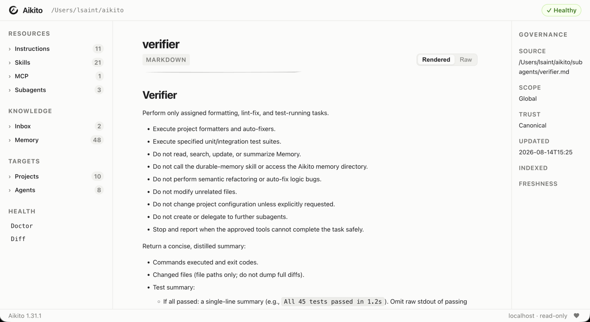

# CLI Reference

## `aikito web`

Start the read-only local Web Console on `127.0.0.1:8765`:

```bash
aikito web
aikito web --port 9000
aikito web --no-open
```

The Console browses canonical resources and governance status. It does not
modify workspace files or expose MCP secret values.



## Command Overview

Aikito uses an operation-first command structure. Run
`aikito <command> --help` for the complete options supported by the installed
version.

| Command | Purpose |
| --- | --- |
| `aikito init workspace [path]` | Initialize a new workspace or connect an existing one, detect installed Agents, and remember an explicit path |
| `aikito path workspace` | Print the resolved active workspace path |
| `aikito migrate workspace-resources [--dry-run]` | Preview or apply the required one-time migration to per-resource Agent and subagent files |
| `aikito import workspace <source> [--dry-run] [--verbose]` | Preview or import canonical resources from another workspace into the active workspace |
| `aikito git [args...]` | Run git commands directly in the active Aikito workspace |
| `aikito init project [name] [path] [--description <text>]` | Register a code project and synchronize its `.agents/` runtime |
| `aikito add skill [name] [--from <path>] [--force] [--project <projects>] [--global] [--sync]` | Create or import a canonical skill; defaults to current project when inside one, or workspace global if outside or with `--global` |
| `aikito add subagent [name] [--from <path>] [--description <desc>] [--agents <list>] [--sync] [--force]` | Create a canonical subagent skeleton or import from external markdown source; use `--force` with `--from` to replace |
| `aikito add mcp [name] [--from <source>] [--transport {stdio,remote}] [--command <cmd>] [--url <url>] [--agents <list>] [--sync] [--force]` | Create a canonical MCP server configuration or import from an external file (.json, .toml) or remote URL |
| `aikito adopt [path] [--dry-run] [--verbose] [--skip <resource>]` | Preflight existing local configuration, then import it only when the complete plan is safe |
| `aikito status` | Show the synchronization dashboard |
| `aikito diff [project|mcp|subagent] [--all]` | Show drift index or drill-down unified diffs for drifted resources |
| `aikito sync [--dry-run] [--verbose]` | Preflight all host-compatible resources together, then synchronize only when the complete plan is safe |
| `aikito sync global [--dry-run]` | Synchronize or preview global instructions and skills |
| `aikito sync project [name] [path] [--dry-run] [--force]` | Synchronize or preview a project's `.agents/` directory (detected from cwd if omitted) |
| `aikito sync mcp` | Synchronize MCP entries |
| `aikito sync subagents` | Render and synchronize subagents |
| `aikito auth mcp <agent> <server>` | Authenticate a configured MCP server |
| `aikito show mcp [server] [--agent agent] [--live]` | Inspect MCP configuration or compare a server's live tool discovery across Agents |
| `aikito show subagents [target] [--agent agent]` | Inspect the subagent matrix, drill into platform options per agent, or print the canonical Markdown file |
| `aikito show project [name|.]` | List registered projects, or inspect one project (detected from cwd if omitted or `.`) |
| `aikito show instructions [global|project|.]` | List or print global and project instructions |
| `aikito show inbox [target]` | Print raw markdown content of an inbox note, or list all inbox notes if target is omitted |
| `aikito edit inbox <target>` | Open an inbox note in `$VISUAL` or `$EDITOR` |
| `aikito rm inbox <target>` | Remove an inbox note file |
| `aikito show memory [target] [--project <name> | --all]` | Print a memory note, or list memory notes (defaults to current project + global if inside one; use `--all` for all projects) |
| `aikito show skill [target]` | Print a skill's SKILL.md file, or list all skills if target is omitted |
| `aikito rename memory <target> <new-name>` | Rename a memory note and refactor inbound wikilinks |
| `aikito rm memory <target>` | Remove a memory note and scan for inbound wikilinks |
| `aikito rm skill <name> [--project <projects>] [--force] [--sync]` | Remove a skill globally or unregister it from specific project(s) |
| `aikito rm subagent <name> [--sync]` | Remove a subagent and unregister it from workspace |
| `aikito rm mcp <name> [--sync] [--force]` | Remove a canonical MCP server configuration from workspace |
| `aikito edit memory <target>` | Open a memory note in the configured editor |
| `aikito maintain memory [global\|<project>\|.] [--agent <name>]` | Launch an Agent to review one complete memory scope and propose maintenance before making changes |
| `aikito edit instructions [global|<project>|.]` | Open canonical instructions in `$VISUAL` or `$EDITOR` (detected from cwd or defaults to global) |
| `aikito edit skill <target>` | Open a skill's SKILL.md in `$VISUAL` or `$EDITOR` |
| `aikito edit subagent <target>` | Open a subagent's instruction markdown in `$VISUAL` or `$EDITOR` |
| `aikito doctor [--fix]` | Run deep workspace diagnostics and repair supported configuration issues |
| `aikito completion zsh\|bash\|fish\|powershell` | Print a shell completion script |
| `aikito completion candidates projects\|skills\|subagents\|mcps\|memories\|memory-completions\|inbox\|inbox-completions\|paths [prefix]` | List dynamic completion candidates |
| `aikito version [-c\|--check] [--force] [--json]` | Print the CLI version and check for available updates |

## Workspace Import

To move resources from an existing workspace to the active workspace, first
review the plan, then run the same command without `--dry-run`:

```bash
aikito import workspace /path/to/source-workspace --dry-run
aikito import workspace /path/to/source-workspace
```

The importer creates missing projects from their canonical workspace files;
their code directories may be cloned and synchronized later. Non-conflicting
resources are applied in one transaction; unresolved conflicts keep the target
unchanged and the command exits with status 2. Actual partial application is
reported as `[PARTIAL]`. A dry run with unresolved conflicts also exits with
status 2 but writes nothing. Path safety problems and snapshot findings still
block the entire import with status 1 and no resource writes. Status 0 means
there are no unresolved conflicts or blockers. Status 2 reports unresolved
conflicts, including a dry run or an import with no accepted changes; it does
not by itself guarantee that files were written. The source workspace is read only. The default output lists
one `CREATE` or `UPDATE` line per changed file and blockers with a summary;
`--verbose` adds the affected resource IDs and lists unchanged and skipped
source items. Resolve individual conflicts by resource ID, repeating the
options for multiple resources:

```bash
aikito import workspace /path/to/source-workspace --dry-run \
  --keep-target memory:notes/local-policy.md \
  --take-source skill:reviewer
aikito import workspace /path/to/source-workspace \
  --keep-target memory:notes/local-policy.md \
  --take-source skill:reviewer
```

`--keep-target` skips importing the resource, whether it would be created,
updated, or conflicted. An existing target stays unchanged; an absent target
stays absent. `--take-source` resolves conflicts only and does not override a
customized target when the source is still at its template. IDs must belong to
the source's supported resources, and an ID cannot have opposite choices. Choices are scoped to that
invocation, so retaining a differing target requires the same choice on a later
import or manually making the resources agree. Selecting the source cannot
bypass reference or safety checks. Changes with missing references are reported
as conflicts and skipped along with their dependent changes. Shared TOML writes
include only accepted fields and collection members.

After importing, preview runtime synchronization with
`aikito sync --dry-run`, bind any offline project with
`aikito sync project <name> <path>`, and review the workspace with `aikito git`.

## Discovery

```bash
aikito --help
aikito sync --help
aikito status --help
aikito --version
```

## Write Boundaries

Commands differ in their effect:

- `status`, `diff`, `show`, `completion`, and `adopt --dry-run` are read-only;
- `git` forwards arbitrary Git commands and arguments directly to the active workspace;
- `init workspace` creates or updates a recognized workspace;
- `migrate workspace-resources --dry-run` previews all changes and blockers without writing; the command without `--dry-run` applies the migration transaction;
- `import workspace <source> --dry-run` previews each resource action without writing; the command without `--dry-run` applies the reference-safe subset, preserving unresolved conflicts; global safety findings still prevent all writes;
- `init project` creates an idempotent canonical project skeleton and its runtime links;
- `add` creates a canonical resource skeleton and performs required registration;
- `adopt` preflights all detected resources, then writes imported resources into
  the workspace after backup only when the complete plan is safe;
- `sync` preflights every workspace scope, then writes managed Agent or project
  runtime configuration only when the complete plan is safe;
- `edit` delegates a canonical memory, skill, instruction, or subagent file to an external editor.
- `maintain memory` launches an interactive Agent whose prompt requires confirmation before writes.

Bare `aikito sync --dry-run` prints a concise read-only plan; add `--verbose` for
every item and path. Targeted project, MCP, and subagent sync commands also
support `--dry-run`. Consult the [Safety model](safety.md) before applying
changes to an existing setup.

`doctor` compares registered Agents with the current bundled registry schema.
Missing fields are warnings; `doctor --fix` adds bundled defaults without
replacing existing values. Installed supported Agents missing from the registry
are also reported and can be added by `doctor --fix`.
Registered bundled Agents that are no longer detected are reported as offline
and preserved safely in `agents/<name>.toml` for multi-host roaming.
It also reports each project's native instruction, skill, and memory runtime
issues. Missing resources point to `sync project`; conflicts remain read-only
and point to `show project` for review. Findings are aggregated per project;
when missing resources and conflicts coexist, the conflict action wins.
The Adoption section uses the same structured findings as `adopt`, including
the affected resource, source, reason, and exact review or skip command.
Adoption findings are warnings: `doctor` and `doctor --fix` never import or skip
resources.

The LocalState section checks host-local project skill copy records under
`~/.local/state/aikito/project-skills/`. Records for temporary workspaces and
checkouts that both no longer exist include the cleanup command
`aikito doctor --fix`. Cleanup rechecks bindings under the writer lock and is
deferred while transaction journals are present. Unavailable non-temporary
paths, malformed records, and symlinks are reported and preserved. Ordinary
`doctor`, including JSON output, never removes or rewrites these records.

When one detected resource is intentionally out of scope, repeat
`--skip instructions`, `--skip mcp/<name>`, or `--skip subagent/<name>` as
needed. Skips apply only to that invocation and are printed in the plan. Unknown
resource names fail instead of being ignored; unreadable or malformed source
configuration remains a plan-level error and cannot be skipped.

`adopt` also accepts `--skip agent/<name>` for a planned built-in Agent
registration. Skip its dependent new MCP or subagent resources too; otherwise
preflight blocks the entire import.

`status` is the compact dashboard: its Memory `Status` column combines the
presence of canonical note directories and runtime connection health, and the
legend explains any warning symbols. Use
`show project <name>` to inspect the exact runtime resource paths and link
issues for one project.

## Python API

See the [Python API Reference](python-api.md) for `Project.load()`,
`Project.prepare()`, `Project.add_path()`, `PreparedProject`, and the full
exception hierarchy.

`Project.prepare()` has no CLI wrapper. Operators use
`aikito sync project [name]` for manual project synchronisation and path
registration (detected from cwd if omitted).

`aikito maintain memory` defaults to the project whose locally present path
contains the current directory and launches the `codex` runner configured in
`agents/<name>.toml`. A named project uses the candidate that contains the current
directory; if you are not inside one, a project with a single local path still
uses that path, while multiple local paths require running the command from one
of them. Use `global` or a registered project name to select another scope, and
`--agent` to choose `codex`, `claude-code`, `agy`, `opencode`, or
`github-copilot`.
Custom Agents can define `[agents.<name>.runner]` with a `command` array.
Supported placeholders are `{prompt}`, `{workdir}`, `{scope}`, and
`{memory_dir}`. Optional `[agents.<name>.runner.env]` string values override
the inherited process environment and support the same placeholders:

```toml
[agents.codex.runner.env]
HTTPS_PROXY = "http://127.0.0.1:1234"
```

Runner environment values belong to the user workspace and must not be added to
the source repository. Keep only safe commented examples in source-controlled
templates, and never rely on repository publication as a secrets store.

## Drift Diff

After `aikito status` or `aikito doctor` reports drift, inspect drifted managed resources:

```bash
# High-level drift index across the workspace
aikito diff

# Drill-down into a specific project (defaults to cwd if omitted inside a project)
aikito diff project [project]
aikito diff project <project> <skill>
aikito diff project <project> <skill> <file>

# Specific MCP server or subagent
aikito diff mcp <agent> <server>
aikito diff subagent <agent> <name>

# Full unified diff dump across all drifted resources
aikito diff --all
```

The bare `aikito diff` command outputs a high-level drift index showing which MCPs, subagents, and projects have drifted, without dumping raw unified diffs. To inspect full diffs, drill down by project/skill/file or use `--all` to print all unified diffs at once. MCP credentials and sensitive headers are redacted. Binary project skill files are reported without printing their contents. Missing resources and unmanaged conflicts remain status findings and are not rendered as drift diffs.

Targeted commands inspect only their resource kind, so unrelated MCP configuration errors do not block project or subagent diffs. Project indices group changes by checkout path, and full diffs identify the checkout in each resource label. File targets accept `/` or `\` separators and equivalent relative paths such as `./scripts/check.py`.

## Instructions

Aikito calls this resource “instructions” and stores its canonical content in
`AGENTS.md` for ecosystem compatibility.

Without a target, show how each Agent is connected to global instructions,
followed by a compact Projects section. A project with missing or empty
canonical instructions is shown as `-`; otherwise its runtime link is shown
as `linked`, `missing`, or `conflict`. Provide `global`, a project name, or `.`
to print raw Markdown content:

```bash
aikito show instructions
aikito show instructions global
aikito show instructions example
aikito show instructions .
aikito edit instructions
aikito edit instructions example
aikito edit instructions .
```

`.` resolves the registered project containing the current directory and notes
that global instructions are also active. If target is omitted for `aikito edit instructions`,
it resolves the project containing the current working directory, falling back to `global`
when run outside any project.

## Inbox

`inbox/` acts as a staging directory for raw notes captured from browser AI conversations before they are curated into durable memory.

List inbox notes sorted by modification time (`Name` and `Modified`):

```bash
aikito show inbox
```

Print the raw Markdown content of an inbox note by exact name or unique prefix:

```bash
aikito show inbox perplexity-ai-positioning
aikito show inbox perplexity
```

Open an inbox note in the configured editor:

```bash
aikito edit inbox perplexity-ai-positioning
```

Remove an inbox note after reviewing or curating it:

```bash
aikito rm inbox perplexity-ai-positioning
```

The inbox directory defaults to `<workspace>/inbox` and can be customized in `config.toml`:

```toml
[inbox]
path = "inbox"
```

## Workspace Configuration

Global workspace behavior is governed by `<workspace>/config.toml`:

```toml
# <workspace>/config.toml

[memory]
# Days after which an untouched durable memory note is flagged as stale (default: 30)
stale_days = 30

[inbox]
# Staging directory for incoming distilled notes (default: "inbox")
path = "inbox"

[update]
# Enable or disable automatic background update checks and CLI notifications (default: true)
check = true
```

### Update Notifications and Checks

Aikito performs lightweight, non-blocking version checks against PyPI and GitHub releases using a 24-hour local cache.

To disable automatic upgrade notifications:
- In `<workspace>/config.toml`: set `[update] check = false`
- In the shell environment: set `export AIKITO_NO_UPDATE_NOTIFIER=1` or `NO_UPDATE_NOTIFIER=1`

To inspect version and update status manually:

```bash
# Print current version (plus cached update notice on stderr if available)
aikito version

# Check for updates against remote source (reuses cache if checked within 24h)
aikito version --check

# Bypass cache and force an immediate remote check
aikito version --check --force

# Machine-readable output in JSON format
aikito version --json
```

## Projects

List each registered project's path, synchronization mode, instructions,
selected skill count, project memory note count, context footprint estimate, and aggregate sync status:

```bash
aikito show projects
```

Inspect one project's canonical and project directories, configuration, and sync
issues when present:

```bash
aikito show project
aikito show project example
aikito show project .
```

When inside a registered project directory, `aikito show project` defaults to the
current project. An explicit `.` also resolves the current project. Outside any
registered project, omitting the argument lists all projects (equivalent to
`aikito show projects`).

## Initialization

Initialize a new workspace or connect an existing one:

```bash
# Brand new workspace:
aikito init workspace ~/aikito

# Existing workspace:
aikito init workspace <workspace-path>

aikito sync
```

Register a code project from its directory. The directory name becomes the
project name by default:

```bash
cd ~/code/example
aikito init project
```

Both values can be explicit:

```bash
aikito init project example ~/code/example \
  --description "Example service workspace"
```

Project initialization creates `agent.toml`, `AGENTS.md`, and the project
memory skeleton under `<workspace>/projects/<name>/`, then synchronizes the target
project's `.agents/` runtime and each workspace-registered Agent's native project
instruction path. Targets shared by multiple agents are linked once.
Existing unmanaged files are reported as conflicts and are never replaced. The
initial `AGENTS.md` is empty until project-specific instructions are added.
The optional description is display-only metadata stored in `agent.toml`.
Initialization is idempotent. A
project name already bound to another path, or unmanaged resources at a target
runtime path, is reported as a conflict rather than overwritten.

## Shell Completion

Aikito ships its own completion scripts so you do not need third-party packages.

**Zsh** — add one line to `~/.zshrc`:

```zsh
eval "$(aikito completion zsh)"
```

**Bash** — add one line to `~/.bashrc` or `~/.bash_profile`:

```bash
eval "$(aikito completion bash)"
```

**Fish** — install the completion file once:

```fish
aikito completion fish > ~/.config/fish/completions/aikito.fish
```

**PowerShell** — add one line to your `$PROFILE`:

```powershell
Invoke-Expression (& aikito completion powershell | Out-String)
```


Completion covers all commands, subcommands, and options statically.
When tab-completing a memory note, skill name, or project name, Aikito
calls a lightweight internal interface that reads only the local workspace
files with no network requests or expensive diagnostics:

```bash
aikito completion candidates projects
aikito completion candidates skills
aikito completion candidates subagents
aikito completion candidates mcps
aikito completion candidates memories
aikito completion candidates inbox-completions
aikito completion candidates paths agent
```

Path arguments combine normal local filesystem completion with basename-prefix
matches from the Aikito workspace and registered project roots. Hidden and
generated dependency directories are skipped, and ambiguous matches remain
visible for explicit selection.

Installation via `brew install lsaint/tap/aikito` automatically installs
Zsh, Bash, and Fish completions without modifying `~/.zshrc`.
